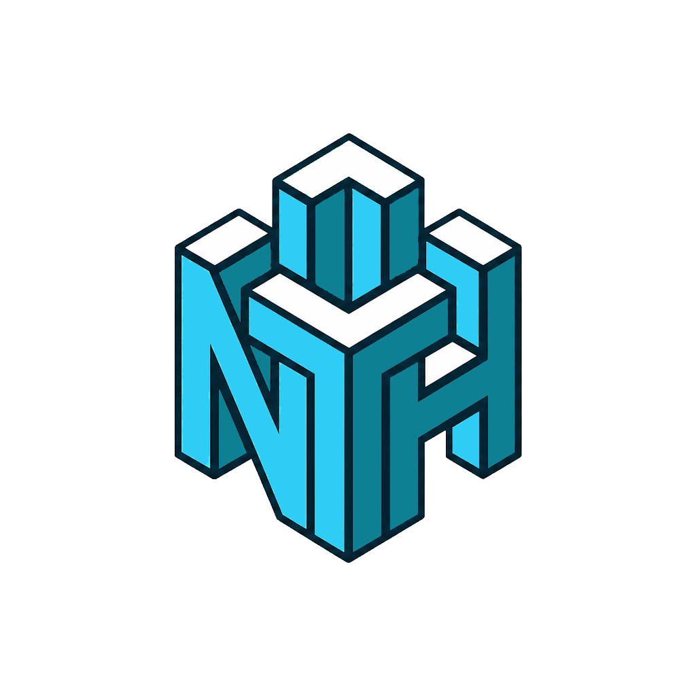

# Free The Last Marble (FTLM)

[Français](README.md) · **English**

**FTLM** stands for **Free The Last Marble**.

The pure goal of a brick-breaker: keep that darn marble bouncing until the very last block is destroyed.

A futuristic **brick-breaker** (Breakout-style) **multiplayer** 3D game, built with **Godot 4.6.3 (.NET / Mono)** in **C#**.

[](https://ko-fi.com/nthstudio)

This game is a personal project built in my spare time. If you enjoy it and want to support it, you can buy me a Ko-fi: [ko-fi.com/nthstudio](https://ko-fi.com/nthstudio). Thank you!

---

## 🎮 Features

- **Local multiplayer for 2/3/4 players** on an arena generated at runtime (radial
  corridors around a central hub).
- **Network multiplayer** with an authoritative host (ENet, port 42424), a lobby with a
  **Ready** system and ~30 Hz snapshot synchronisation.
- **Headless dedicated server** (`--serveur`) with no local player, driven by stdin
  commands, filling empty slots with **AI**.
- Per-slot **AI** opponents, **multi-hit bricks**, bonus / malus **capsules**,
  **multi-ball**, laser / active ability.
- Persistent **score / lives / best score** (`user://meilleur_score.dat`).
- Procedural **sound effects** and **particles**.
- Menu, player selection, **pause** and **options** (per-player remappable keys).

## 🕹️ Controls

| Action | Player 1 | Player 2 | Player 3 | Player 4 |
| --- | --- | --- | --- | --- |
| Move | ◀ / ▶ (+ mouse) | A / D | J / L | Numpad 4 / 6 |
| Launch ball | Space / left click | W | I | Numpad 5 |
| Ability / laser | Alt / right click | S | K | Numpad 8 |
| Pause | Esc | — | — | — |

> All keys are remappable in **Options ▸ Keys**.

## 🛠️ Tech stack

- **Engine:** Godot **4.6.3** (Mono).
- **Language:** C# (`net8.0` desktop, `net9.0` Android).
- **Physics:** **Jolt**.
- **Rendering:** Forward+, Direct3D 12 on Windows.
- **Main scene:** `res://MainMenu.tscn`.

## 🚀 Getting started (development)

The Godot executable is **not** on the PATH — use the full path (the `_console`
variant for command-line work):

```powershell
# Build C#
dotnet build

# Run the game
& "C:\DEV\Godot\Godot_v4.6.3-stable_mono_win64_console.exe" --path .

# Open the editor
& "C:\DEV\Godot\Godot_v4.6.3-stable_mono_win64_console.exe" --path . --editor
```

### Useful launch modes

| Argument | Effect |
| --- | --- |
| `-- --test` | Auto-test: plays a full game, prints `[TEST] …`, then quits. |
| `--serveur [--port <n>] [--joueurs <n>]` | Headless dedicated server (port 42424, 2 players by default). |
| `-- --nethost` / `-- --netjoin` | Two-instance network test (host + client). |
| `--headless --import` | Re-imports assets (after adding `Audio/` files, etc.). |

## 📥 Download / Play

Windows builds are published in the **[Releases](../../releases)** section.

> ℹ️ A Windows build needs **all** the files from the `Build/` folder together
> (`FTLM.exe` + `FTLM.pck` + `data_FTLM_windows_x86_64`): the exe alone won't run.
> Extract the full archive, then launch `FTLM.exe`.

## 📄 License

**MIT** license — free to use, modify and redistribute. See [LICENSE](LICENSE).

## 🏢 Studio

<a href="https://nthstudio.eu"></a>

Developed by **[NTH Studio](https://nthstudio.eu)**.
